# URL Shortener

A modern, fast, and responsive URL shortener web application built using Node.js, Express, Sequelize, and PostgreSQL. It allows users to convert long, cumbersome URLs into neat, trackable short links.

## 🌟 Project Summary
This project provides a complete full-stack solution for shortening URLs. The frontend is a sleek, animated glassmorphism UI built with HTML/CSS and EJS templates, ensuring a seamless user experience. The backend is a robust REST API that leverages Express and Sequelize ORM to securely store and retrieve URL mappings from a PostgreSQL database (supporting both local environments and managed services like Neon). 

Key features include:
- **URL Validation**: Ensures only valid web addresses are processed.
- **Deduplication**: Checks if a URL has already been shortened to prevent database bloat.
- **Click Tracking**: Automatically counts how many times a short link is visited.
- **Rate Limiting**: Protects the API from spam and abuse (via `express-rate-limit`).
- **Responsive UI**: A beautiful, dynamic frontend with smooth animations.

---

## 🏗️ Project Structure

The codebase follows a modular MVC (Model-View-Controller) architecture to maintain clean separation of concerns:

```text
📦 url-shortener
 ┣ 📂 src
 ┃ ┣ 📂 config
 ┃ ┃ ┣ 📜 db.js              # Database connection logic (Neon / Local PG)
 ┃ ┃ ┗ 📜 env.js             # Environment variables configuration
 ┃ ┣ 📂 controllers
 ┃ ┃ ┗ 📜 url.controller.js  # Business logic for generating and redirecting URLs
 ┃ ┣ 📂 middlewares
 ┃ ┃ ┗ 📜 ...                # Express middlewares (e.g., rate limiting)
 ┃ ┣ 📂 models
 ┃ ┃ ┗ 📜 url.model.js       # Sequelize schema definition (id, longUrl, shortUrl, clicks)
 ┃ ┣ 📂 routes
 ┃ ┃ ┗ 📜 url.route.js       # Express router definitions for API endpoints
 ┃ ┣ 📂 views
 ┃ ┃ ┗ 📜 index.ejs          # Frontend UI template
 ┃ ┣ 📜 app.js               # Express application setup
 ┃ ┗ 📜 server.js            # Main entry point, starts the server
 ┣ 📜 .env                   # Environment variables (not committed)
 ┣ 📜 package.json           # Project dependencies and scripts
 ┗ 📜 README.md              # Project documentation
```

### Tech Stack:
- **Backend:** Node.js, Express.js
- **Database:** PostgreSQL (Neon), Sequelize ORM
- **Frontend:** EJS, Vanilla CSS, Vanilla JavaScript
- **Utilities:** `nanoid` (for short ID generation), `dotenv` (environment variables)

---

## 🔄 Application Flowchart

The system handles two primary workflows: **Shortening a URL** and **Redirecting a user**.

```mermaid
graph TD
    %% Styling
    classDef user fill:#8b5cf6,stroke:#fff,stroke-width:2px,color:#fff;
    classDef frontend fill:#ec4899,stroke:#fff,stroke-width:2px,color:#fff;
    classDef backend fill:#3b82f6,stroke:#fff,stroke-width:2px,color:#fff;
    classDef database fill:#10b981,stroke:#fff,stroke-width:2px,color:#fff;

    %% Shortening Flow
    subgraph Shortening Process
        A[User enters Long URL]:::user --> B[Frontend UI validates input & sends POST request]:::frontend
        B --> C[Backend receives POST /]:::backend
        C --> D{Is URL format valid?}:::backend
        D -- No --> E[Return 400 Error]:::backend
        D -- Yes --> F[Query Database for existing URL]:::database
        F --> G{Does URL exist?}:::backend
        G -- Yes --> H[Return existing Short URL]:::backend
        G -- No --> I[Generate 8-char nanoid]:::backend
        I --> J[Save mapping to PostgreSQL]:::database
        J --> K[Return new Short URL]:::backend
        H --> L[Frontend displays Short URL to User]:::frontend
        K --> L
    end

    %% Redirecting Flow
    subgraph Redirection Process
        M[User clicks Short URL]:::user --> N[Backend receives GET /:shortUrl]:::backend
        N --> O[Query Database by short code]:::database
        O --> P{Record found?}:::backend
        P -- No --> Q[Return 404 Not Found]:::backend
        P -- Yes --> R[Increment click count in DB]:::database
        R --> S[Redirect Browser to Long URL]:::backend
    end
```



## 🚀 Getting Started

### Prerequisites
- Node.js (v16+)
- PostgreSQL Database (Local or Neon)

### Installation
1. Clone the repository.
2. Run `npm install` to install dependencies.
3. Create a `.env` file and populate it with your Database credentials (reference `src/config/env.js`).
4. Run `npm run dev` to start the server in development mode.
5. Visit `http://localhost:3000` in your browser.
